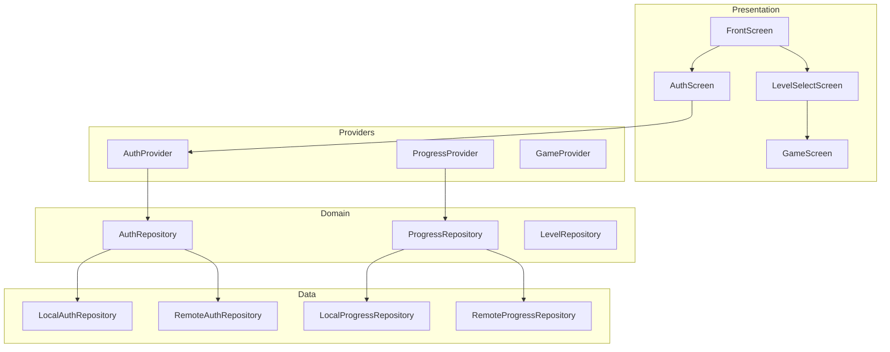

# Design Document: App Enhancement

## Overview

This design transforms One-Draw into "HexBuzz", a polished honeybee-themed hexagonal puzzle game. The enhancement includes a front screen, improved level selection with stats, user authentication, generated assets, refined color scheme, proper render ordering, smooth animations, and improved contrast throughout.

## Steering Document Alignment

### Technical Standards
- **Flutter/Dart**: Continues using Flutter with Riverpod state management
- **Clean Architecture**: Maintains Domain/Data/Presentation layer separation
- **Repository Pattern**: Auth and progress persistence via repository interfaces

### Project Structure
- New screens added under `lib/presentation/screens/`
- New services under `lib/domain/services/`
- Assets in `assets/images/` and `assets/icons/`
- Animations in `lib/presentation/widgets/animations/`

## Code Reuse Analysis

### Existing Components to Leverage
- **HoneyTheme (`honey_theme.dart`)**: Extend with refined honeybee colors
- **ProgressProvider (`progress_provider.dart`)**: Extend for auth-aware persistence
- **LevelCellWidget (`level_cell_widget.dart`)**: Extend to show time/stars
- **CompletionOverlay (`completion_overlay.dart`)**: Enhance with better animations
- **HexGridWidget (`hex_grid_widget.dart`)**: Refactor render order
- **PathPainter (`path_painter.dart`)**: Update gradient colors

### Integration Points
- **SharedPreferences**: Continue for local storage (guest mode)
- **New Auth Backend**: Simple REST API or Firebase Auth
- **Stable Diffusion API**: Asset generation via Automatic1111

## Architecture



## Components and Interfaces

### Component 1: FrontScreen
- **Purpose**: Welcoming entry point with branding and tap-to-start
- **Location**: `lib/presentation/screens/front/front_screen.dart`
- **Interfaces**:
  - `onTap()` → Navigate to LevelSelectScreen
- **Dependencies**: AuthProvider (check login state), AssetService (logo)
- **Reuses**: HoneyTheme colors, navigation patterns

### Component 2: AuthScreen
- **Purpose**: Login, registration, and guest mode selection
- **Location**: `lib/presentation/screens/auth/auth_screen.dart`
- **Interfaces**:
  - `login(username, password)` → AuthResult
  - `register(username, password)` → AuthResult
  - `playAsGuest()` → Navigate to LevelSelect
- **Dependencies**: AuthProvider, AuthRepository
- **Reuses**: HoneyTheme, form validation patterns

### Component 3: AuthRepository (Interface)
- **Purpose**: Abstract authentication operations
- **Location**: `lib/domain/services/auth_repository.dart`
- **Interfaces**:
  ```dart
  abstract class AuthRepository {
    Future<AuthResult> login(String username, String password);
    Future<AuthResult> register(String username, String password);
    Future<void> logout();
    Future<User?> getCurrentUser();
    Stream<User?> authStateChanges();
  }
  ```
- **Dependencies**: None (interface only)

### Component 4: LocalAuthRepository
- **Purpose**: Simple local authentication (for demo/offline)
- **Location**: `lib/data/local/local_auth_repository.dart`
- **Dependencies**: SharedPreferences, crypto (for password hashing)
- **Reuses**: Existing SharedPreferences patterns

### Component 5: EnhancedLevelCell
- **Purpose**: Display level with stars AND best time
- **Location**: `lib/presentation/widgets/level_cell/level_cell_widget.dart` (modify)
- **Interfaces**:
  - Props: `levelIndex`, `stars`, `bestTime`, `isUnlocked`, `isCompleted`
- **Dependencies**: ProgressProvider
- **Reuses**: Existing LevelCellWidget, extend with time display

### Component 6: AnimatedCellPaint
- **Purpose**: Animate cell fill when visited
- **Location**: `lib/presentation/widgets/animations/animated_cell_paint.dart`
- **Interfaces**:
  - `AnimatedCellPaint({required bool isVisited, required Widget child})`
- **Dependencies**: AnimationController
- **Reuses**: Existing visited state from HexCellWidget

### Component 7: HexGridPainter (Refactored)
- **Purpose**: Render game board with correct layer order
- **Location**: `lib/presentation/widgets/hex_grid/hex_grid_widget.dart` (modify)
- **Render Order**:
  1. Cell backgrounds (unvisited)
  2. Visited cell paint
  3. Path line
  4. Checkpoint numbers (on top)
  5. Wall segments
- **Reuses**: Existing painter, reorder draw calls

### Component 8: AssetGenerator (CLI Tool)
- **Purpose**: Generate game assets via Stable Diffusion
- **Location**: `tool/generate_assets.dart`
- **Interfaces**:
  - `generateAsset(prompt, outputPath)` → File
- **Dependencies**: HTTP client, Automatic1111 API
- **Configuration**: 512x512, steps: 20, cfg_scale: 7.0

## Data Models

### User Model
```dart
class User {
  final String id;
  final String username;
  final DateTime createdAt;
  final bool isGuest;
}
```

### AuthResult Model
```dart
class AuthResult {
  final bool success;
  final User? user;
  final String? errorMessage;
}
```

### Enhanced ProgressState
```dart
// Existing LevelProgress already has:
// - completed: bool
// - stars: int
// - bestTime: Duration?

// No changes needed to model, just display
```

## Color Scheme Update

### Current Colors (to replace)
- Path gradient: Blue → Purple (remove)
- Cell visited: Various blues (remove)

### New Honeybee Palette
| Element | Current | New | Hex |
|---------|---------|-----|-----|
| Cell Unvisited | Light orange | Warm cream | #FFF8E1 |
| Cell Visited | Blue tint | Honey gold light | #FFE082 |
| Path Start | Blue | Honey gold | #FFC107 |
| Path Mid | Purple | Deep amber | #FFB300 |
| Path End | Dark purple | Deep orange | #FF8F00 |
| Checkpoint Text | Dark brown | Dark brown | #3E2723 |
| Star Filled | Gold | Bright gold | #FFD700 |
| Star Empty | Gray | Warm gray | #BDBDBD |

### Contrast Requirements
- Text on cream background: Use #3E2723 (contrast 10:1)
- Stars on level cell: Use stroke/shadow for empty stars
- Checkpoint on path: Use white outline or shadow

## Render Layer Order

```
Layer 5 (Top):    Checkpoint numbers + Wall segments
Layer 4:          Path line (gradient stroke)
Layer 3:          Visited cell fill (animated)
Layer 2:          Cell borders
Layer 1 (Bottom): Cell background fill
```

Implementation in `_HexGridPainter.paint()`:
```dart
void paint(Canvas canvas, Size size) {
  // 1. Draw all cell backgrounds
  _drawCellBackgrounds(canvas);

  // 2. Draw cell borders
  _drawCellBorders(canvas);

  // 3. Draw visited cell overlays (with animation)
  _drawVisitedCells(canvas);

  // 4. Draw path line
  _drawPath(canvas);

  // 5. Draw walls
  _drawWalls(canvas);

  // 6. Draw checkpoint numbers (always on top)
  _drawCheckpoints(canvas);
}
```

## Animation Specifications

### Cell Visit Animation
- **Trigger**: Cell added to path
- **Duration**: 200ms
- **Curve**: Curves.easeOutCubic
- **Effect**: Scale 0.8→1.0 + Opacity 0.0→1.0

### Path Extension Animation
- **Trigger**: Path segment added
- **Duration**: 150ms
- **Effect**: Line draws from previous point to new point

### Screen Transitions
- **Type**: SlideTransition + FadeTransition
- **Duration**: 300ms
- **Curve**: Curves.easeInOut
- **Direction**: Right-to-left for forward, left-to-right for back

### Button Tap Feedback
- **Duration**: 100ms down, 100ms up
- **Effect**: Scale 0.95 on press, 1.0 on release

### Completion Overlay
- **Card**: Scale 0.8→1.0 with bounce (Curves.elasticOut), 400ms
- **Stars**: Sequential pop with 150ms delay between each
- **Buttons**: Fade in after stars complete

## Asset Generation Prompts

### App Icon
```
Prompt: "hexagonal honeycomb pattern with a cute bee, game app icon,
golden amber colors, clean vector style, centered composition,
no text, professional mobile game icon"
Negative: "blurry, text, words, letters, realistic, photograph"
```

### Level Button Background
```
Prompt: "single hexagonal cell, honeycomb texture, golden honey color,
subtle 3D effect, game UI element, clean edges, centered"
Negative: "multiple hexagons, bee, text, busy, cluttered"
```

### Lock Icon
```
Prompt: "padlock icon made of honeycomb pattern, golden amber color,
game UI icon, simple clean design, transparent background style"
Negative: "realistic, photograph, complex, detailed"
```

### Star Icons
```
Prompt: "five-pointed star icon, golden honey color, game achievement star,
clean vector style, slight glow effect, centered"
Negative: "realistic, 3D, complex shading"
```

## Error Handling

### Authentication Errors
1. **Invalid Credentials**
   - **Handling**: Show error message, clear password field
   - **User Impact**: "Invalid username or password. Please try again."

2. **Network Error**
   - **Handling**: Offer retry or guest mode
   - **User Impact**: "Cannot connect. Play as guest or try again."

3. **Registration Conflict**
   - **Handling**: Show error, suggest login
   - **User Impact**: "Username already exists. Try logging in."

### Asset Loading Errors
1. **Missing Asset**
   - **Handling**: Fall back to colored placeholder
   - **User Impact**: Slightly degraded visuals, game still playable

### Progress Sync Errors
1. **Save Failed**
   - **Handling**: Queue for retry, store locally
   - **User Impact**: Silent retry, notify only after repeated failures

## Testing Strategy

### Unit Testing
- AuthRepository: Login/register/logout flows
- ProgressProvider: Level completion updates
- StarCalculator: Time-to-stars conversion
- Color utilities: Contrast calculations

### Widget Testing
- FrontScreen: Tap navigation
- AuthScreen: Form validation, submission
- LevelCell: Star/time display variants
- Animations: Controller lifecycle

### Integration Testing
- Full auth flow: Register → Login → Play → Progress saved
- Guest flow: Play → Local progress → Reinstall loses data
- Render order: Screenshot comparison tests

### End-to-End Testing
- Complete user journey from install to level completion
- Animation smoothness (no jank)
- Accessibility: VoiceOver/TalkBack compatibility
