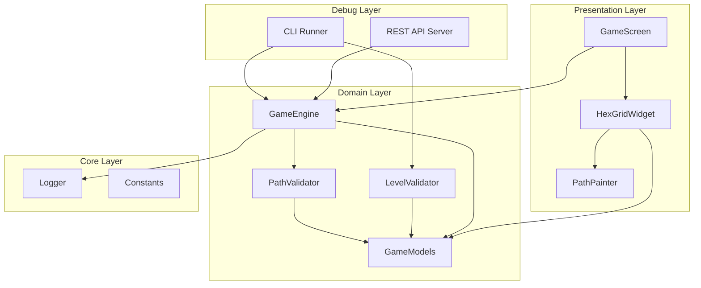

# Design Document - Honeycomb One Pass MVP

## Overview

This design document describes the technical implementation of the Honeycomb One Pass MVP - a one-stroke puzzle game on a hexagonal grid. The MVP focuses on core gameplay for web platform with AI Agent-first development (CLI/REST API before UI).

## Steering Document Alignment

### Technical Standards (tech.md)
- **Flutter/Dart**: Cross-platform framework, web target for MVP
- **Clean Architecture**: Domain logic separated from UI
- **Development Principles**: KISS prioritized - minimal abstractions, simple implementations
- **Pre-commit**: 500 lines/file, 50 lines/function, complexity < 10

### Project Structure (structure.md)
- `lib/domain/` - Game logic (no Flutter dependencies)
- `lib/presentation/` - Flutter UI widgets
- `lib/debug/` - REST API and CLI
- `lib/core/` - Logging and utilities

## Code Reuse Analysis

### Existing Components to Leverage
- **None** - This is a greenfield MVP project

### Integration Points
- **Flutter Canvas API**: For hexagonal grid rendering
- **shelf package**: For REST API server
- **args package**: For CLI argument parsing

## Architecture



### Modular Design Principles
- **Single File Responsibility**: One model/service per file
- **Component Isolation**: HexGrid rendering isolated from game logic
- **Service Layer Separation**: GameEngine handles state, PathValidator handles rules
- **Utility Modularity**: Logging in core/, not mixed with domain

## Components and Interfaces

### HexCell (Model)
- **Purpose**: Represents a single hexagonal cell in the grid
- **Location**: `lib/domain/models/hex_cell.dart`
```dart
class HexCell {
  final int q;           // Axial coordinate q
  final int r;           // Axial coordinate r
  final int? checkpoint; // Checkpoint number (null if none)
  bool visited;          // Has been visited in current path
}
```

### HexEdge (Model)
- **Purpose**: Represents an edge between two adjacent cells (for walls)
- **Location**: `lib/domain/models/hex_edge.dart`
```dart
/// Represents an edge between two adjacent hex cells.
/// Edges are undirected: HexEdge(A, B) == HexEdge(B, A)
class HexEdge {
  final (int, int) cell1;  // (q, r) of first cell
  final (int, int) cell2;  // (q, r) of second cell (must be adjacent)

  // Canonical form ensures cell1 < cell2 for equality comparison
  HexEdge.canonical(this.cell1, this.cell2);
}
```

### Level (Model)
- **Purpose**: Represents a puzzle level configuration with walls
- **Location**: `lib/domain/models/level.dart`
```dart
class Level {
  final String id;                   // Unique hash of level structure
  final int size;                    // Grid size (e.g., 4 for 4x4)
  final List<HexCell> cells;         // All cells in the grid
  final Set<HexEdge> walls;          // Edges where passage is blocked
  final List<int> checkpointOrder;   // [1, 2, 3...] checkpoint sequence

  /// Compute canonical hash for level identity (for DB storage/deduplication)
  String computeHash();
}
```

**Wall Concept**:
- A wall is placed on an **edge** between two adjacent cells
- If a wall exists between cell A and cell B, the player cannot move between them
- Walls enable level generation to constrain paths and guarantee exactly one solution
- Visually rendered as thick lines on cell boundaries

**Level Identity (for Future Leaderboard)**:
- Each level has a deterministic hash computed from: size, checkpoint positions, wall positions
- Hash enables:
  - **DB storage**: Store playable levels with their hash as primary key
  - **Duplicate detection**: Reject identical levels during generation
  - **Daily challenge**: All users play the same level (fetched by date)
  - **Practice mode**: Instantly generated levels (not stored in leaderboard)

### GameMode (Enum)
- **Purpose**: Distinguishes ranked vs practice play
- **Location**: `lib/domain/models/game_mode.dart`
```dart
enum GameMode {
  daily,     // Today's global challenge - scores go to leaderboard
  practice,  // Instant random generation - no leaderboard
}
```

**Future Use**:
- MVP: Practice mode only (no backend)
- Post-MVP: Daily mode fetches level from server, submits completion time

### GameState (Model)
- **Purpose**: Represents current game state
- **Location**: `lib/domain/models/game_state.dart`
```dart
class GameState {
  final Level level;
  final List<HexCell> path;          // Current drawn path
  final int nextCheckpoint;          // Next checkpoint to reach
  final DateTime? startTime;         // When player started
  final DateTime? endTime;           // When player completed (null if not done)
  final bool isComplete;             // Win condition met
}
```

### GameEngine (Service)
- **Purpose**: Core game state machine - handles moves, undo, reset
- **Location**: `lib/domain/services/game_engine.dart`
- **Interfaces**:
  - `GameState get state` - Current game state
  - `bool tryMove(HexCell target)` - Attempt move to cell
  - `void undo()` - Remove last path segment
  - `void reset()` - Reset level to initial state
- **Dependencies**: PathValidator, Logger
- **Requirements**: REQ-003, REQ-004, REQ-005, REQ-006, REQ-007

### PathValidator (Service)
- **Purpose**: Validates if a move is legal (considering walls)
- **Location**: `lib/domain/services/path_validator.dart`
- **Interfaces**:
  - `bool isValidMove(GameState state, HexCell target)` - Check move validity
  - `bool isAdjacent(HexCell a, HexCell b)` - Check cell adjacency
  - `bool isPassable(Level level, HexCell from, HexCell to)` - Check no wall blocks path
  - `bool checkWinCondition(GameState state)` - Check if puzzle solved
- **Dependencies**: None (pure functions)
- **Requirements**: REQ-004, REQ-007

**Move Validation Logic**:
1. Target cell must be adjacent to current cell
2. No wall between current cell and target cell
3. Target cell not already visited
4. If target has checkpoint, it must be the next expected checkpoint

### LevelValidator (Service)
- **Purpose**: Validates if a level is solvable (for CLI)
- **Location**: `lib/domain/services/level_validator.dart`
- **Interfaces**:
  - `ValidationResult validate(Level level)` - Check solvability
  - `List<HexCell>? findSolution(Level level)` - Find solution path
- **Dependencies**: PathValidator
- **Requirements**: REQ-009

### HexGridWidget (UI)
- **Purpose**: Renders hexagonal grid and handles touch input
- **Location**: `lib/presentation/widgets/hex_grid/hex_grid_widget.dart`
- **Interfaces**:
  - `onCellTap(HexCell cell)` - Callback for cell interaction
  - `onDragUpdate(HexCell cell)` - Callback for drag over cell
- **Dependencies**: GameState (read-only), PathPainter
- **Requirements**: REQ-001, REQ-002, REQ-003

### PathPainter (UI)
- **Purpose**: Draws the path with color gradient effect
- **Location**: `lib/presentation/widgets/hex_grid/path_painter.dart`
- **Interfaces**:
  - `void paint(Canvas canvas, List<HexCell> path)` - Draw path
- **Dependencies**: None
- **Requirements**: REQ-003

### GameScreen (UI)
- **Purpose**: Main game screen with grid and reset button
- **Location**: `lib/presentation/screens/game/game_screen.dart`
- **Interfaces**: None (top-level screen)
- **Dependencies**: HexGridWidget, GameEngine (via Provider)
- **Requirements**: REQ-006, REQ-007

### REST API Server (Debug)
- **Purpose**: HTTP endpoints for AI agent interaction
- **Location**: `lib/debug/api/server.dart`
- **Endpoints**:
  - `GET /api/game/state` - Returns GameState as JSON
  - `POST /api/game/move` - Body: `{"q": int, "r": int}` - Execute move
  - `POST /api/game/reset` - Reset level
- **Dependencies**: GameEngine, shelf
- **Requirements**: REQ-008

### CLI Runner (Debug)
- **Purpose**: Command-line interface for level validation
- **Location**: `lib/debug/cli/cli_runner.dart`
- **Commands**:
  - `validate --level <json>` - Validate level solvability
- **Dependencies**: LevelValidator, args
- **Requirements**: REQ-009

## Data Models

### HexCell
```dart
class HexCell {
  final int q;           // Axial q coordinate (-size to +size)
  final int r;           // Axial r coordinate (-size to +size)
  final int? checkpoint; // 1, 2, 3... or null
  bool visited;          // Mutable: path tracking

  // Computed: pixel position for rendering
  Offset toPixel(double cellSize);

  // Computed: list of 6 adjacent cell coordinates
  List<(int, int)> get neighbors;
}
```

### HexEdge
```dart
/// Represents a wall between two adjacent cells.
/// Uses canonical ordering for consistent equality.
class HexEdge {
  final (int, int) cell1;  // (q, r) - always the "lesser" cell
  final (int, int) cell2;  // (q, r) - always the "greater" cell

  /// Factory that ensures canonical ordering
  factory HexEdge((int, int) a, (int, int) b) {
    // Order by q first, then by r
    if (a.$1 < b.$1 || (a.$1 == b.$1 && a.$2 < b.$2)) {
      return HexEdge._(a, b);
    }
    return HexEdge._(b, a);
  }

  /// Check if this edge connects given cells
  bool connects((int, int) a, (int, int) b);

  // For JSON serialization
  Map<String, dynamic> toJson();
  factory HexEdge.fromJson(Map<String, dynamic> json);
}
```

### Level
```dart
class Level {
  final String id;                       // Canonical hash (computed)
  final int size;
  final Map<(int, int), HexCell> cells;  // Indexed by (q, r)
  final Set<HexEdge> walls;              // Blocked edges
  final int checkpointCount;

  HexCell? getCell(int q, int r);
  HexCell get startCell;  // Checkpoint 1
  HexCell get endCell;    // Highest checkpoint

  /// Check if movement between two cells is blocked by a wall
  bool hasWall((int, int) from, (int, int) to) {
    return walls.contains(HexEdge(from, to));
  }

  /// Get passable neighbors (adjacent cells without walls)
  List<HexCell> getPassableNeighbors(HexCell cell);

  /// Compute deterministic hash for level identity
  /// Hash is based on: size, sorted checkpoint positions, sorted wall edges
  /// Used for: DB primary key, duplicate detection, daily challenge matching
  String computeHash() {
    // 1. Encode size
    // 2. Encode checkpoints as sorted list of (q, r, number)
    // 3. Encode walls as sorted list of canonical edges
    // 4. SHA-256 hash of combined data
    // Returns: first 16 chars of hex hash
  }
}
```

### GameState
```dart
class GameState {
  final Level level;
  final GameMode mode;               // daily or practice
  final List<HexCell> path;
  final int nextCheckpoint;
  final DateTime? startTime;
  final DateTime? endTime;

  bool get isStarted => path.isNotEmpty;
  bool get isComplete => endTime != null;
  Duration? get elapsedTime;

  // For leaderboard submission (future)
  bool get canSubmitToLeaderboard => mode == GameMode.daily && isComplete;

  // Immutable state updates
  GameState copyWith({...});
}
```

### GameMode
```dart
enum GameMode {
  daily,     // Globally shared level - eligible for leaderboard
  practice,  // Locally generated - no leaderboard
}
```

### API Response Models
```dart
class GameStateResponse {
  final String levelId;              // Level hash (for deduplication/leaderboard)
  final String mode;                 // "daily" or "practice"
  final int gridSize;
  final List<CellResponse> cells;
  final List<WallResponse> walls;    // List of blocked edges
  final List<PathSegment> path;
  final int nextCheckpoint;
  final bool isComplete;
  final int? elapsedMs;
  final bool canSubmitToLeaderboard; // true if daily mode and complete
}

class CellResponse {
  final int q;
  final int r;
  final int? checkpoint;
  final bool visited;
}

class WallResponse {
  final int q1, r1;  // First cell
  final int q2, r2;  // Second cell
}

class MoveRequest {
  final int q;
  final int r;
}

class MoveResponse {
  final bool success;
  final String? error;    // e.g., "wall_blocked", "already_visited", "not_adjacent"
  final GameStateResponse? state;
}
```

## Error Handling

### Error Scenarios

1. **Invalid Move Attempt (UI)**
   - **Handling**: PathValidator returns false, move ignored silently
   - **User Impact**: No visual change, path stays as-is

2. **Wall Blocked Move (UI)**
   - **Handling**: PathValidator detects wall, move ignored
   - **User Impact**: Optional visual feedback (wall highlight)

3. **Invalid Move Attempt (API)**
   - **Handling**: Return 400 with error JSON `{"error": "Invalid move", "reason": "wall_blocked|already_visited|not_adjacent|wrong_checkpoint"}`
   - **User Impact**: AI agent receives structured error with specific reason

4. **Level Load Failure**
   - **Handling**: Fall back to hardcoded default level
   - **User Impact**: Game still playable, log warning

5. **API Server Startup Failure**
   - **Handling**: Log error, continue without API (UI-only mode)
   - **User Impact**: Game works, API unavailable

## Testing Strategy

### Unit Testing
- **HexEdge**: Test canonical ordering, equality, connects() method
- **PathValidator**: Test adjacency, wall blocking, checkpoint order validation
- **GameEngine**: Test move, undo, reset state transitions, wall-blocked moves
- **LevelValidator**: Test solvability detection, solution finding with walls
- **Coverage target**: 80% for domain layer

### Integration Testing
- **REST API**: Test all endpoints with mock GameEngine
- **CLI**: Test validate command with sample levels

### End-to-End Testing
- **Web gameplay**: Complete a level via touch/mouse
- **API gameplay**: Complete a level via REST API calls

### Test File Structure
```
test/
├── domain/
│   ├── models/
│   │   ├── hex_cell_test.dart
│   │   ├── hex_edge_test.dart      # Wall/edge model tests
│   │   ├── level_test.dart
│   │   └── game_state_test.dart
│   └── services/
│       ├── path_validator_test.dart  # Includes wall-blocking tests
│       ├── game_engine_test.dart
│       └── level_validator_test.dart
├── debug/
│   ├── api/
│   │   └── server_test.dart
│   └── cli/
│       └── cli_runner_test.dart
└── presentation/
    └── widgets/
        └── hex_grid_widget_test.dart
```
