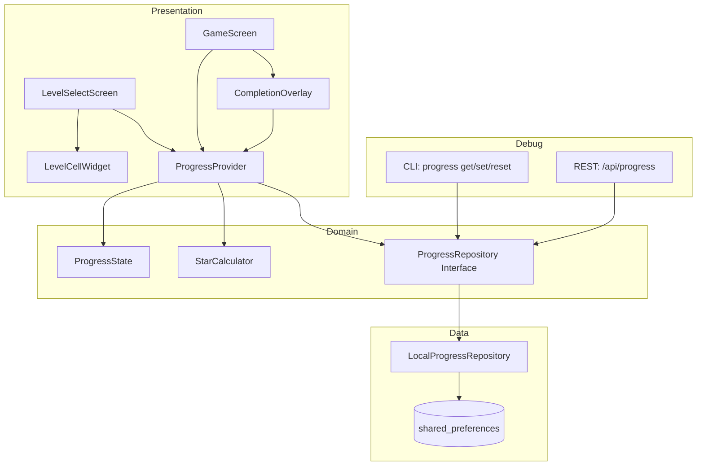
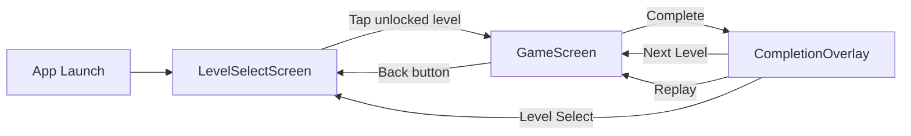

# Design Document: Level Selection UI & Game Polish

## Overview

This design implements a level selection system with progressive unlocking, star ratings, and honey/bee themed UI for Honeycomb One Pass. Following the AI Agent-First development philosophy, we implement CLI/API interfaces first, then domain logic, and finally UI components.

## Steering Document Alignment

### Technical Standards (tech.md)

| Standard | Implementation |
|----------|----------------|
| **KISS (Highest)** | Simple data structures: `Map<String, LevelProgress>` for progress, direct time→stars thresholds |
| **SOLID** | ProgressRepository (persistence), StarCalculator (logic), ProgressNotifier (state) as separate classes |
| **Clean Architecture** | domain/ for models+services, data/ for persistence, presentation/ for UI |
| **Riverpod** | `progressProvider` for reactive state management |
| **60 FPS** | Lazy loading for level grid, simple animations |

### Project Structure (structure.md)

```
lib/
├── domain/
│   ├── models/
│   │   └── progress_state.dart      # LevelProgress, ProgressState models
│   └── services/
│       ├── star_calculator.dart     # Time → stars logic
│       └── progress_repository.dart # Abstract interface
│
├── data/
│   └── local/
│       └── local_progress_repository.dart  # shared_preferences impl
│
├── presentation/
│   ├── screens/
│   │   └── level_select/
│   │       └── level_select_screen.dart
│   ├── widgets/
│   │   ├── level_cell/
│   │   │   └── level_cell_widget.dart
│   │   └── completion_overlay/
│   │       └── completion_overlay.dart
│   ├── providers/
│   │   └── progress_provider.dart
│   └── theme/
│       └── honey_theme.dart
│
└── debug/
    ├── cli/commands/
    │   └── progress_command.dart
    └── api/routes/
        └── progress_routes.dart
```

## Code Reuse Analysis

### Existing Components to Leverage

| Component | Location | How to Use |
|-----------|----------|------------|
| **LevelRepository** | `lib/domain/services/level_repository.dart` | Get level by index for level select; provides `getLevelCount()`, `getLevelById()` |
| **GameState** | `lib/domain/models/game_state.dart` | Extend to track current level index; use `elapsedTime` for star calculation |
| **GameEngine** | `lib/domain/services/game_engine.dart` | Add completion callback for progress updates |
| **HexCellWidget** | `lib/presentation/widgets/hex_grid/hex_cell_widget.dart` | Adapt styling for level select cells |
| **gameProvider** | `lib/presentation/providers/game_provider.dart` | Add level index tracking, integrate with progressProvider |

### Integration Points

| Integration | Description |
|-------------|-------------|
| **GameNotifier → ProgressNotifier** | On level completion, call `progressProvider.completeLevel(levelIndex, time)` |
| **LevelSelectScreen → GameScreen** | Navigate with level index, load from LevelRepository by index |
| **shared_preferences** | New dependency for LocalProgressRepository persistence |

## Architecture



### Navigation Flow



## Components and Interfaces

### Component 1: ProgressState (Domain Model)

- **Purpose:** Immutable data model for player progress across all levels
- **Location:** `lib/domain/models/progress_state.dart`
- **Interfaces:**
  ```dart
  class LevelProgress {
    final bool completed;
    final int stars;          // 0-3
    final Duration? bestTime;
  }

  class ProgressState {
    final Map<int, LevelProgress> levels;  // levelIndex → progress
    final int highestUnlocked;             // computed from levels

    bool isUnlocked(int levelIndex);
    int getStars(int levelIndex);
    Duration? getBestTime(int levelIndex);
    ProgressState withLevelCompleted(int levelIndex, Duration time, int stars);
  }
  ```
- **Dependencies:** None (pure Dart)

### Component 2: StarCalculator (Domain Service)

- **Purpose:** Calculate star rating from completion time
- **Location:** `lib/domain/services/star_calculator.dart`
- **Interfaces:**
  ```dart
  class StarCalculator {
    static const thresholds = {
      3: Duration(seconds: 10),
      2: Duration(seconds: 30),
      1: Duration(seconds: 60),
    };

    int calculateStars(Duration completionTime);
  }
  ```
- **Dependencies:** None (pure Dart, easily testable)

### Component 3: ProgressRepository (Domain Interface)

- **Purpose:** Abstract interface for progress persistence
- **Location:** `lib/domain/services/progress_repository.dart`
- **Interfaces:**
  ```dart
  abstract class ProgressRepository {
    Future<ProgressState> load();
    Future<void> save(ProgressState state);
    Future<void> reset();
  }
  ```
- **Dependencies:** None (interface only)

### Component 4: LocalProgressRepository (Data Implementation)

- **Purpose:** Persist progress to device local storage
- **Location:** `lib/data/local/local_progress_repository.dart`
- **Interfaces:** Implements `ProgressRepository`
- **Dependencies:** `shared_preferences` package
- **Reuses:** JSON serialization pattern from `Level.toJson()`/`fromJson()`

### Component 5: ProgressNotifier (Presentation Provider)

- **Purpose:** Riverpod state management for progress
- **Location:** `lib/presentation/providers/progress_provider.dart`
- **Interfaces:**
  ```dart
  class ProgressNotifier extends AsyncNotifier<ProgressState> {
    Future<void> completeLevel(int levelIndex, Duration time);
    Future<void> resetProgress();
  }

  final progressProvider = AsyncNotifierProvider<ProgressNotifier, ProgressState>();
  ```
- **Dependencies:** `ProgressRepository`, `StarCalculator`
- **Reuses:** Pattern from existing `GameNotifier`

### Component 6: LevelSelectScreen (Presentation)

- **Purpose:** Display grid of levels with progress status
- **Location:** `lib/presentation/screens/level_select/level_select_screen.dart`
- **Interfaces:**
  ```dart
  class LevelSelectScreen extends ConsumerWidget {
    // Displays GridView of LevelCellWidgets
    // Handles navigation to GameScreen with level index
  }
  ```
- **Dependencies:** `progressProvider`, `levelRepositoryProvider`
- **Reuses:** `HexCellWidget` styling patterns

### Component 7: LevelCellWidget (Presentation)

- **Purpose:** Individual level cell showing number, stars, lock status
- **Location:** `lib/presentation/widgets/level_cell/level_cell_widget.dart`
- **Interfaces:**
  ```dart
  class LevelCellWidget extends StatelessWidget {
    final int levelIndex;
    final bool isUnlocked;
    final int stars;
    final VoidCallback? onTap;
  }
  ```
- **Dependencies:** `HoneyTheme`

### Component 8: CompletionOverlay (Presentation)

- **Purpose:** Show completion feedback with stars, time, navigation options
- **Location:** `lib/presentation/widgets/completion_overlay/completion_overlay.dart`
- **Interfaces:**
  ```dart
  class CompletionOverlay extends StatelessWidget {
    final Duration completionTime;
    final int starsEarned;
    final bool hasNextLevel;
    final VoidCallback onNextLevel;
    final VoidCallback onReplay;
    final VoidCallback onLevelSelect;
  }
  ```
- **Dependencies:** `HoneyTheme`, star animation

### Component 9: HoneyTheme (Presentation)

- **Purpose:** Centralized theme configuration for honey/bee styling
- **Location:** `lib/presentation/theme/honey_theme.dart`
- **Interfaces:**
  ```dart
  class HoneyTheme {
    // Colors
    static const Color honeyGold = Color(0xFFFFC107);
    static const Color deepHoney = Color(0xFFFF8F00);
    static const Color warmCream = Color(0xFFFFF8E1);
    static const Color brownAccent = Color(0xFF795548);

    // ThemeData
    static ThemeData get lightTheme;

    // Custom styles
    static BoxDecoration get honeycombCell;
    static BoxDecoration get lockedCell;
  }
  ```
- **Dependencies:** Flutter material

### Component 10: CLI Progress Command (Debug)

- **Purpose:** CLI interface for progress management
- **Location:** `lib/debug/cli/commands/progress_command.dart`
- **Interfaces:**
  ```dart
  // honeycomb-cli progress get
  // honeycomb-cli progress set --level 5 --stars 3
  // honeycomb-cli progress reset
  ```
- **Dependencies:** `ProgressRepository`
- **Reuses:** Pattern from existing `ValidateCommand`, `GenerateCommand`

### Component 11: Progress API Routes (Debug)

- **Purpose:** REST API for progress management
- **Location:** `lib/debug/api/routes/progress_routes.dart`
- **Interfaces:**
  ```
  GET  /api/progress           → ProgressState JSON
  POST /api/progress/complete  → {levelIndex, time} → updated state
  POST /api/progress/reset     → reset all progress
  ```
- **Dependencies:** `ProgressRepository`
- **Reuses:** Pattern from existing `level_routes.dart`

## Data Models

### LevelProgress
```dart
class LevelProgress {
  final bool completed;     // Has the level been completed at least once?
  final int stars;          // Best star rating (0-3)
  final Duration? bestTime; // Best completion time

  const LevelProgress({
    this.completed = false,
    this.stars = 0,
    this.bestTime,
  });

  Map<String, dynamic> toJson();
  factory LevelProgress.fromJson(Map<String, dynamic> json);
}
```

### ProgressState
```dart
class ProgressState {
  final Map<int, LevelProgress> levels; // levelIndex (0-based) → progress

  const ProgressState({this.levels = const {}});

  /// Level 0 is always unlocked; others require previous completion
  bool isUnlocked(int levelIndex) {
    if (levelIndex == 0) return true;
    return levels[levelIndex - 1]?.completed ?? false;
  }

  int get highestUnlocked {
    // Find highest index where previous is completed
  }

  int getStars(int levelIndex) => levels[levelIndex]?.stars ?? 0;

  int get totalStars => levels.values.fold(0, (sum, p) => sum + p.stars);

  ProgressState withLevelCompleted(int levelIndex, Duration time, int stars);

  Map<String, dynamic> toJson();
  factory ProgressState.fromJson(Map<String, dynamic> json);
}
```

### Storage Format (JSON)
```json
{
  "version": 1,
  "levels": {
    "0": {"completed": true, "stars": 3, "bestTimeMs": 8500},
    "1": {"completed": true, "stars": 2, "bestTimeMs": 25000},
    "2": {"completed": false, "stars": 0, "bestTimeMs": null}
  }
}
```

## Error Handling

### Error Scenarios

1. **Corrupted Progress Data**
   - **Handling:** Catch `FormatException` in `LocalProgressRepository.load()`, return default `ProgressState()`
   - **User Impact:** Progress reset to initial state, Level 1 unlocked only
   - **Logging:** Log warning with corrupted data details

2. **Storage Write Failure**
   - **Handling:** Catch exceptions in `save()`, retry once, then log error
   - **User Impact:** Progress may not persist; show no error to user (silent failure)
   - **Logging:** Log error with stack trace

3. **Level Not Found**
   - **Handling:** `LevelRepository.getLevelByIndex()` returns null if index out of bounds
   - **User Impact:** Navigate back to level select, show toast "Level not available"
   - **Logging:** Log warning

4. **Tap on Locked Level**
   - **Handling:** Check `isUnlocked()` before navigation, play shake animation
   - **User Impact:** Visual feedback (shake), haptic feedback (if enabled)
   - **Logging:** None (expected user action)

## Testing Strategy

### Unit Testing

| Component | Test File | Key Tests |
|-----------|-----------|-----------|
| `StarCalculator` | `test/domain/services/star_calculator_test.dart` | Boundary conditions: 9.99s→3★, 10.00s→3★, 10.01s→2★, 29.99s→2★, etc. |
| `ProgressState` | `test/domain/models/progress_state_test.dart` | `isUnlocked()` logic, `withLevelCompleted()` immutability, JSON round-trip |
| `LevelProgress` | Same as above | JSON serialization, default values |

### Integration Testing

| Flow | Test File | Key Tests |
|------|-----------|-----------|
| Progress Persistence | `test/data/local/local_progress_repository_test.dart` | Save/load round-trip, corrupted data handling |
| CLI Commands | `test/debug/cli/progress_command_test.dart` | `get`, `set`, `reset` commands produce correct output |

### Widget Testing

| Component | Test File | Key Tests |
|-----------|-----------|-----------|
| `LevelSelectScreen` | `test/presentation/screens/level_select_screen_test.dart` | Shows correct lock/unlock states, tap navigates for unlocked only |
| `LevelCellWidget` | `test/presentation/widgets/level_cell_widget_test.dart` | Displays stars, lock icon, level number |
| `CompletionOverlay` | `test/presentation/widgets/completion_overlay_test.dart` | Shows earned stars, navigation buttons work |

### End-to-End Testing

| Scenario | Test File | Steps |
|----------|-----------|-------|
| Complete First Level | `integration_test/level_progression_test.dart` | Launch → Level 1 → Complete → Verify Level 2 unlocked → Navigate to Level 2 |
| Star Improvement | Same | Complete level slowly (1★) → Replay → Complete fast (3★) → Verify 3★ saved |
