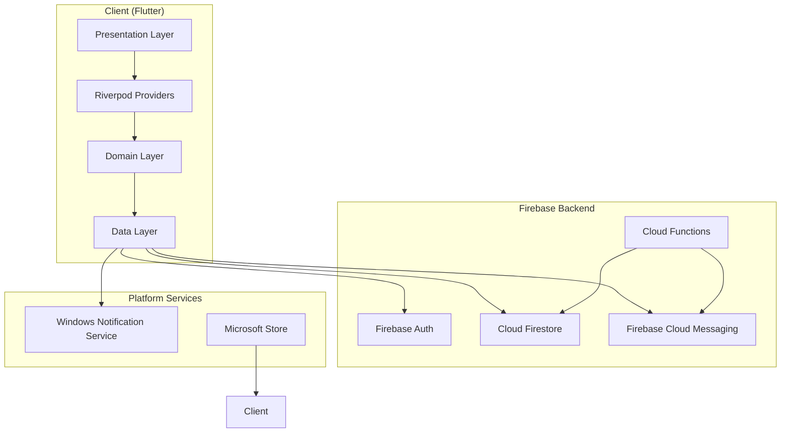
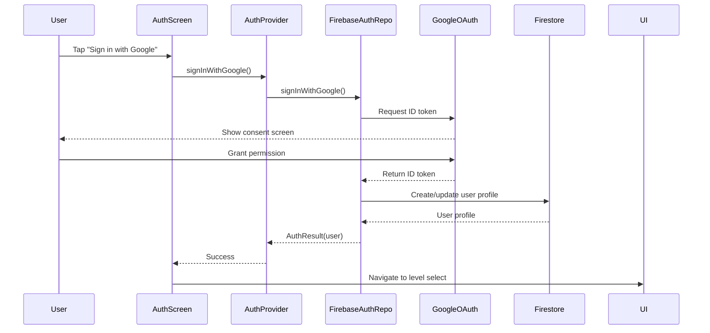
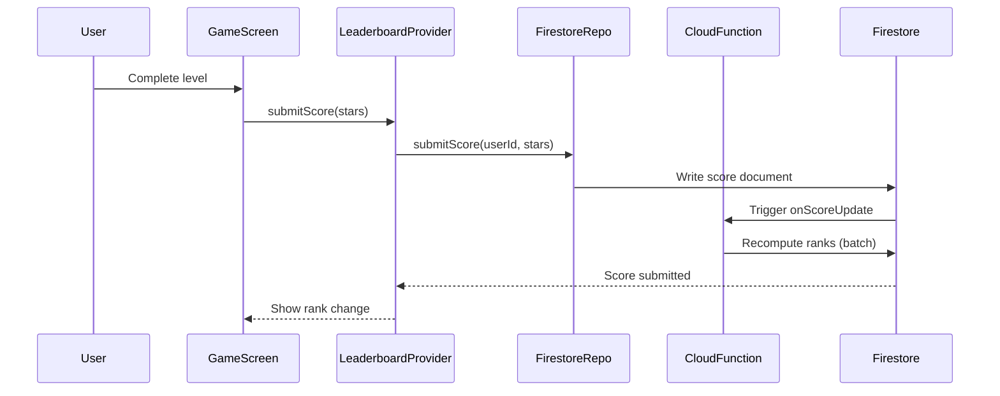
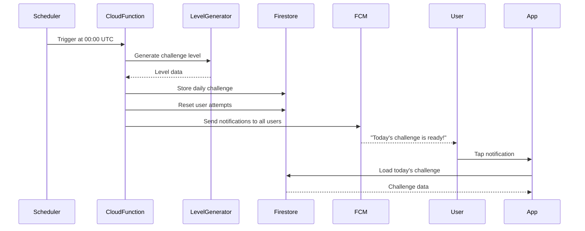

# Design Document: Social & Competitive Features

## Overview

This design implements Google Authentication, Global Leaderboards, Daily Challenge System with Push Notifications, and Microsoft Store deployment for HexBuzz. The architecture follows a clean separation between authentication, competitive features, and platform-specific concerns, with Firebase as the cloud backend and multiple platform outputs (Android, iOS, Web, Windows).

## Steering Document Alignment

### Technical Standards (tech.md)

- **SOLID Principles**: AuthRepository, LeaderboardRepository, NotificationService are separate interfaces with single responsibilities
- **Dependency Injection**: All Firebase dependencies injected via Riverpod providers
- **Error Handling**: Structured logging with JSON format for all cloud operations
- **Code Metrics**: All files <500 lines, functions <50 lines
- **Testing**: 80%+ coverage for domain logic, 90%+ for authentication/payment flows

### Project Structure (structure.md)

```
lib/
├── domain/
│   ├── models/
│   │   ├── user.dart (existing, enhanced)
│   │   ├── auth_result.dart (new)
│   │   ├── leaderboard_entry.dart (new)
│   │   └── daily_challenge.dart (new)
│   └── services/
│       ├── auth_repository.dart (new, interface)
│       ├── leaderboard_repository.dart (new, interface)
│       └── notification_service.dart (new, interface)
├── data/
│   ├── firebase/
│   │   ├── firebase_auth_repository.dart (new)
│   │   ├── firestore_leaderboard_repository.dart (new)
│   │   └── fcm_notification_service.dart (new)
│   └── local/
│       └── leaderboard_cache_repository.dart (new)
├── presentation/
│   ├── screens/
│   │   ├── auth/
│   │   │   └── auth_screen.dart (new)
│   │   ├── leaderboard/
│   │   │   └── leaderboard_screen.dart (new)
│   │   └── daily_challenge/
│   │       └── daily_challenge_screen.dart (new)
│   ├── providers/
│   │   ├── auth_provider.dart (new)
│   │   ├── leaderboard_provider.dart (new)
│   │   └── daily_challenge_provider.dart (new)
│   └── widgets/
│       ├── leaderboard_entry_widget.dart (new)
│       └── rank_badge_widget.dart (new)
├── debug/
│   ├── cli/commands/
│   │   ├── auth_command.dart (new)
│   │   ├── leaderboard_command.dart (new)
│   │   └── daily_challenge_command.dart (new)
│   └── api/routes/
│       ├── auth_routes.dart (new)
│       ├── leaderboard_routes.dart (new)
│       └── daily_challenge_routes.dart (new)
└── platform/
    └── windows/
        └── notification_plugin.dart (new, WNS integration)
```

## Code Reuse Analysis

### Existing Components to Leverage

- **domain/models/user.dart**: Extend with `uid`, `email`, `photoURL`, `totalStars`, `rank`
- **domain/models/progress_state.dart**: Use for local progress tracking, sync to Firestore
- **domain/services/star_calculator.dart**: Reuse for scoring both local and competitive play
- **domain/services/level_repository.dart**: Source levels for daily challenges
- **presentation/theme/honey_theme.dart**: Apply consistent theming to new screens
- **debug/cli/cli_runner.dart**: Add new commands to existing CLI framework
- **debug/api/server.dart**: Mount new routes on existing debug API server

### Integration Points

- **Firebase Authentication**: Google OAuth provider for user identity
- **Cloud Firestore**: Store user profiles, leaderboard scores, daily challenges
- **Cloud Functions**: Server-side leaderboard ranking, daily challenge generation, notification triggers
- **Firebase Cloud Messaging (FCM)**: Push notifications for Android, iOS, Web
- **Windows Notification Service (WNS)**: Push notifications for Windows Store app
- **Flutter MSIX**: Package Windows app for Microsoft Store submission

## Architecture

### High-Level Architecture



### Authentication Flow



### Leaderboard Flow



### Daily Challenge Flow



## Components and Interfaces

### Component 1: AuthRepository

- **Purpose:** Abstract interface for authentication operations
- **Interfaces:**
  ```dart
  abstract class AuthRepository {
    Future<AuthResult> signInWithGoogle();
    Future<void> signOut();
    Stream<User?> get authStateChanges;
    Future<User?> getCurrentUser();
  }
  ```
- **Dependencies:** None (pure interface)
- **Reuses:** None (new component)
- **Implementation:** `FirebaseAuthRepository` using `google_sign_in` and `firebase_auth`

### Component 2: LeaderboardRepository

- **Purpose:** Abstract interface for leaderboard operations
- **Interfaces:**
  ```dart
  abstract class LeaderboardRepository {
    Future<List<LeaderboardEntry>> getTopPlayers({int limit = 100});
    Future<LeaderboardEntry?> getUserRank(String userId);
    Future<void> submitScore(String userId, int stars);
    Future<List<LeaderboardEntry>> getDailyChallengeLeaderboard(String date);
    Stream<List<LeaderboardEntry>> watchLeaderboard({int limit = 100});
  }
  ```
- **Dependencies:** `LeaderboardEntry` model
- **Reuses:** None (new component)
- **Implementation:** `FirestoreLeaderboardRepository` with local caching

### Component 3: DailyChallengeRepository

- **Purpose:** Abstract interface for daily challenge operations
- **Interfaces:**
  ```dart
  abstract class DailyChallengeRepository {
    Future<DailyChallenge?> getTodaysChallenge();
    Future<void> submitChallengeCompletion(String userId, int stars, Duration time);
    Future<List<DailyChallengeEntry>> getChallengeLeaderboard(String date);
    Future<bool> hasCompletedToday(String userId);
  }
  ```
- **Dependencies:** `DailyChallenge` model, `Level` model
- **Reuses:** `LevelGenerator` for creating challenge levels
- **Implementation:** `FirestoreDailyChallengeRepository`

### Component 4: NotificationService

- **Purpose:** Abstract interface for push notifications
- **Interfaces:**
  ```dart
  abstract class NotificationService {
    Future<void> initialize();
    Future<String?> getDeviceToken();
    Future<void> subscribeToTopic(String topic);
    Future<void> unsubscribeFromTopic(String topic);
    Stream<RemoteMessage> get onMessageReceived;
    Future<void> requestPermission();
  }
  ```
- **Dependencies:** None (pure interface)
- **Reuses:** None (new component)
- **Implementation:** `FCMNotificationService` for mobile/web, `WNSNotificationService` for Windows

### Component 5: AuthProvider (Riverpod)

- **Purpose:** Reactive state management for authentication
- **Interfaces:**
  ```dart
  class AuthNotifier extends AsyncNotifier<User?> {
    Future<void> signInWithGoogle();
    Future<void> signOut();
  }

  final authProvider = AsyncNotifierProvider<AuthNotifier, User?>(AuthNotifier.new);
  ```
- **Dependencies:** `AuthRepository`
- **Reuses:** Existing provider patterns from `GameProvider`, `ProgressProvider`
- **Implementation:** Uses `FirebaseAuthRepository` injected via provider override

### Component 6: LeaderboardProvider (Riverpod)

- **Purpose:** Reactive state management for leaderboard data
- **Interfaces:**
  ```dart
  class LeaderboardNotifier extends AsyncNotifier<List<LeaderboardEntry>> {
    Future<void> refresh();
    Future<void> submitScore(int stars);
  }

  final leaderboardProvider = AsyncNotifierProvider<LeaderboardNotifier, List<LeaderboardEntry>>(LeaderboardNotifier.new);
  ```
- **Dependencies:** `LeaderboardRepository`, `AuthProvider`
- **Reuses:** Provider patterns
- **Implementation:** Manages leaderboard state with automatic refresh

### Component 7: Cloud Functions

- **Purpose:** Server-side logic for leaderboard ranking and daily challenges
- **Functions:**
  - `onScoreUpdate`: Triggered when user submits score, recalculates ranks
  - `generateDailyChallenge`: Scheduled function (00:00 UTC) to create daily challenge
  - `sendDailyChallengeNotifications`: Triggered after challenge generation
  - `onUserCreated`: Triggered when new user signs up, initializes leaderboard entry
- **Dependencies:** Cloud Firestore, FCM Admin SDK
- **Reuses:** `LevelGenerator` logic (ported to Node.js/TypeScript)
- **Implementation:** TypeScript Cloud Functions with Firebase Admin SDK

## Data Models

### User Model (Enhanced)

```dart
class User {
  final String uid;              // Firebase user ID
  final String email;            // Google email
  final String displayName;      // Google display name
  final String? photoURL;        // Google profile photo
  final int totalStars;          // Cumulative stars earned
  final int completedLevels;     // Number of levels completed
  final int? rank;               // Global leaderboard rank
  final DateTime createdAt;      // Account creation timestamp
  final DateTime lastLoginAt;    // Last login timestamp
}
```

### AuthResult Model

```dart
class AuthResult {
  final User? user;
  final String? errorMessage;
  final bool isSuccess;

  const AuthResult.success(this.user) : isSuccess = true, errorMessage = null;
  const AuthResult.failure(this.errorMessage) : isSuccess = false, user = null;
}
```

### LeaderboardEntry Model

```dart
class LeaderboardEntry {
  final String userId;
  final String username;
  final String? avatarUrl;
  final int totalStars;
  final int rank;
  final DateTime updatedAt;

  // For daily challenges
  final Duration? completionTime;
  final int? stars;
}
```

### DailyChallenge Model

```dart
class DailyChallenge {
  final String id;               // Date string YYYY-MM-DD
  final DateTime date;
  final Level level;             // The challenge level
  final int completionCount;     // How many players completed
  final Duration? userBestTime;  // Current user's best time (if completed)
  final int? userStars;          // Current user's stars (if completed)
  final int? userRank;           // Current user's rank (if completed)
}
```

## Firestore Schema

### Collections

**users**: User profiles and progress
```
/users/{userId}
  - uid: string
  - email: string
  - displayName: string
  - photoURL: string (nullable)
  - totalStars: number
  - completedLevels: number
  - rank: number (denormalized, computed by Cloud Function)
  - createdAt: timestamp
  - lastLoginAt: timestamp
  - deviceTokens: array<string> (FCM tokens)
  - notificationSettings: map
    - dailyChallenge: boolean
    - rankChange: boolean
    - reEngagement: boolean
```

**leaderboard**: Global rankings
```
/leaderboard/{userId}
  - userId: string
  - username: string
  - avatarUrl: string (nullable)
  - totalStars: number
  - rank: number (computed)
  - updatedAt: timestamp
```

**dailyChallenges**: Daily challenge data
```
/dailyChallenges/{date}  // date format: YYYY-MM-DD
  - date: string
  - levelData: map (serialized Level)
  - completionCount: number
  - createdAt: timestamp

  /entries/{userId}  // Subcollection
    - userId: string
    - username: string
    - avatarUrl: string (nullable)
    - stars: number
    - time: number (milliseconds)
    - rank: number
    - completedAt: timestamp
```

**scoreSubmissions**: Write-only collection for score submissions (triggers Cloud Function)
```
/scoreSubmissions/{submissionId}
  - userId: string
  - levelIndex: number
  - stars: number
  - time: number
  - totalStars: number (user's new total)
  - submittedAt: timestamp
```

### Indexes

Required composite indexes:
- `leaderboard`: (totalStars DESC, updatedAt DESC)
- `dailyChallenges/{date}/entries`: (stars DESC, time ASC) for ranking
- `users`: (rank ASC) for reverse lookup

### Security Rules

```javascript
rules_version = '2';
service cloud.firestore {
  match /databases/{database}/documents {
    // Users can read/write their own profile
    match /users/{userId} {
      allow read: if request.auth != null;
      allow write: if request.auth.uid == userId;
    }

    // Anyone authenticated can read leaderboard
    match /leaderboard/{userId} {
      allow read: if request.auth != null;
      allow write: if false;  // Only Cloud Functions can write
    }

    // Anyone authenticated can read daily challenges
    match /dailyChallenges/{date} {
      allow read: if request.auth != null;
      allow write: if false;  // Only Cloud Functions can write

      match /entries/{userId} {
        allow read: if request.auth != null;
        allow write: if false;  // Only Cloud Functions can write
      }
    }

    // Score submissions (write-only, triggers Cloud Function)
    match /scoreSubmissions/{submissionId} {
      allow read: if false;
      allow write: if request.auth != null && request.auth.uid == request.resource.data.userId;
    }
  }
}
```

## Error Handling

### Error Scenarios

1. **Authentication Failure**
   - **Handling:** Catch GoogleSignIn exceptions, display user-friendly error
   - **User Impact:** "Sign-in failed. Please try again." with retry button
   - **Logging:** Log error with user action context, error code

2. **Network Offline**
   - **Handling:** Use cached leaderboard data, show "Offline" indicator
   - **User Impact:** "You're offline. Showing cached leaderboard."
   - **Logging:** Log offline state entry/exit

3. **Firestore Permission Denied**
   - **Handling:** Catch permission errors, re-authenticate if token expired
   - **User Impact:** "Session expired. Please sign in again."
   - **Logging:** Log permission error with operation context

4. **Score Submission Failure**
   - **Handling:** Retry submission up to 3 times with exponential backoff
   - **User Impact:** "Submitting score..." spinner, then success/failure message
   - **Logging:** Log submission attempts, retry count, final result

5. **Daily Challenge Generation Failure**
   - **Handling:** Cloud Function retries, falls back to previous day's challenge rotated
   - **User Impact:** "Today's challenge is loading..." (transparent to user)
   - **Logging:** Alert to monitoring system for manual intervention

6. **Push Notification Permission Denied**
   - **Handling:** Gracefully degrade, save preference locally
   - **User Impact:** "Notifications disabled. You can enable them in settings."
   - **Logging:** Log permission denial, don't retry automatically

7. **Microsoft Store Validation Failure**
   - **Handling:** Pre-validate with WACK before submission
   - **User Impact:** N/A (developer-side issue)
   - **Logging:** Log validation errors, fix before resubmission

## Platform-Specific Considerations

### Windows (Microsoft Store)

**Packaging:**
- Use `flutter build windows --release` to generate MSIX
- Configure `msix_config` in `pubspec.yaml`:
  ```yaml
  msix_config:
    display_name: HexBuzz
    publisher_display_name: Your Publisher Name
    identity_name: YourPublisher.HexBuzz
    publisher: CN=YOUR_PUBLISHER_ID
    capabilities: internetClient, codeGeneration
    logo_path: assets/icons/windows_icon.png
  ```

**Notifications:**
- Use `flutter_local_notifications` with WNS backend
- Register with Windows Push Notification Service
- Handle notification clicks to deep link into app

**UI Adaptations:**
- Support mouse hover states for interactive elements
- Keyboard shortcuts (Ctrl+Z for undo, Escape for back)
- Window resizing with responsive layout (min 720x480)

### Android/iOS/Web

**Firebase Configuration:**
- Android: `android/app/google-services.json`
- iOS: `ios/Runner/GoogleService-Info.plist`
- Web: Firebase config in `web/index.html`

**Deep Links:**
- Android: Configure intent filters in `AndroidManifest.xml`
- iOS: Configure universal links in `Info.plist`
- Web: Handle URL routes for notification deep links

## Testing Strategy

### Unit Testing

**Domain Layer:**
- AuthRepository interface mock tests
- LeaderboardRepository interface mock tests
- User model serialization tests
- LeaderboardEntry ranking logic tests
- DailyChallenge model tests

**Services:**
- StarCalculator integration with leaderboard
- Notification permission flow tests

### Integration Testing

**Firebase Integration:**
- Mock Firestore for repository tests
- Test score submission flow end-to-end
- Test leaderboard ranking computation
- Test daily challenge creation and retrieval

**Authentication Flow:**
- Mock Google Sign-In for auth flow tests
- Test user profile creation/update
- Test session persistence
- Test logout flow

### End-to-End Testing

**User Journeys:**
1. Sign in → View leaderboard → Complete level → See rank update
2. Sign in → Play daily challenge → Submit score → View daily leaderboard
3. Receive notification → Tap → Navigate to daily challenge
4. Windows: Install from Store → Sign in → Play → Close app → Reopen (session restored)

**Cloud Function Testing:**
- Test score submission trigger and rank computation
- Test daily challenge generation schedule
- Test notification sending

### Platform Testing

**Windows:**
- Run WACK (Windows App Certification Kit) before submission
- Test on Windows 10 and Windows 11
- Test with different screen sizes and DPI settings
- Test keyboard/mouse/touch input

**Mobile:**
- Test on Android 8+ and iOS 13+
- Test push notifications on real devices
- Test offline mode and reconnection

## Performance Optimizations

### Caching Strategy

- **Leaderboard**: Cache for 5 minutes, refresh on pull-to-refresh
- **User Profile**: Cache locally, sync on background
- **Daily Challenge**: Cache after first load, invalidate at 00:00 UTC

### Firestore Read Optimization

- Use pagination (50 entries per page) for leaderboard
- Use `limit()` queries to fetch only needed data
- Implement snapshot listeners only for user's own data
- Use denormalization (store rank in user doc) to avoid complex queries

### Cloud Function Optimization

- Batch rank computations (update all ranks in single transaction)
- Use Firestore triggers instead of polling
- Implement rate limiting for score submissions (max 1 per second per user)

## Deployment Strategy

### Firebase Setup

1. Create Firebase project in console
2. Enable Authentication (Google provider)
3. Enable Firestore
4. Enable Cloud Functions
5. Enable FCM
6. Deploy security rules: `firebase deploy --only firestore:rules`
7. Deploy Cloud Functions: `firebase deploy --only functions`

### Microsoft Store Submission

1. Create Microsoft Partner Center account ($19 one-time fee)
2. Reserve app name "HexBuzz"
3. Build MSIX: `flutter build windows --release`
4. Run WACK validation
5. Prepare store assets:
   - App icon: 44x44, 71x71, 150x150, 310x310
   - Screenshots: 1280x720 (minimum 4 required)
   - Store listing description
   - Privacy policy URL
6. Submit for certification (typically 24-48 hours)
7. Publish to store after approval

### CI/CD Pipeline

```yaml
# .github/workflows/deploy-firebase.yml
name: Deploy Firebase
on:
  push:
    branches: [main]
jobs:
  deploy:
    runs-on: ubuntu-latest
    steps:
      - uses: actions/checkout@v2
      - uses: actions/setup-node@v2
      - run: npm install -g firebase-tools
      - run: firebase deploy --only functions,firestore:rules
        env:
          FIREBASE_TOKEN: ${{ secrets.FIREBASE_TOKEN }}
```

```yaml
# .github/workflows/build-windows.yml
name: Build Windows MSIX
on:
  push:
    tags: ['v*']
jobs:
  build:
    runs-on: windows-latest
    steps:
      - uses: actions/checkout@v2
      - uses: subosito/flutter-action@v2
      - run: flutter build windows --release
      - run: flutter pub run msix:create
      - uses: actions/upload-artifact@v2
        with:
          name: msix-package
          path: build/windows/runner/Release/*.msix
```

## Security Considerations

- **API Keys**: Use environment variables, never commit to repo
- **Firestore Rules**: Thoroughly test security rules before production
- **Rate Limiting**: Implement in Cloud Functions to prevent abuse
- **Input Validation**: Validate all user inputs server-side
- **GDPR Compliance**: Implement user data deletion endpoint
- **App Check**: Enable Firebase App Check to prevent API abuse

## Monitoring & Analytics

**Firebase Analytics Events:**
- `login_success` / `login_failure`
- `score_submitted`
- `leaderboard_viewed`
- `daily_challenge_completed`
- `notification_received` / `notification_clicked`

**Cloud Function Monitoring:**
- Execution time and failure rate
- Score submission latency
- Daily challenge generation success rate

**Alerts:**
- Cloud Function errors > 5% error rate
- Firestore quota approaching limit
- Notification delivery failure rate > 10%
